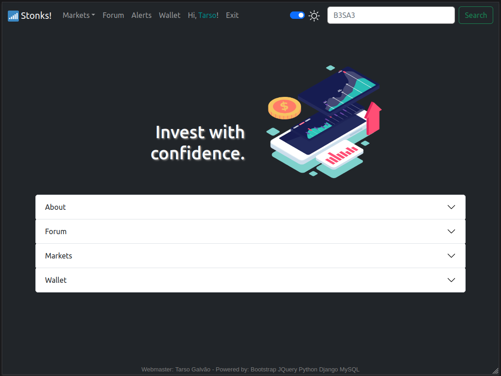

### [Stonks!:tm:](stonks-project)  -  Stocks with Django.

<h5>Introduction:</h5>

This web app consists of five modules to control individual users on forums, custom stock price alerts, personal stock wallet and a live stock price tracker. It is written in Python using the Django framework with Celery and Redis for socket communication, yahoo-fin for price checking and Plotly for graphs.

  

