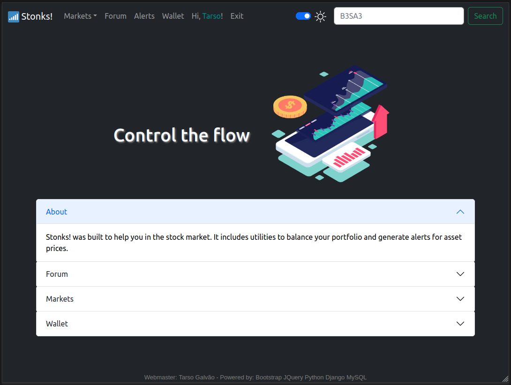

# Stonks!™️ - Stocks with Django

Stonks!™️ is a web app built using the Django framework, designed to provide users with various tools for managing and tracking stocks. The app includes modules for user forums, custom stock price alerts, personal stock wallet, and a live stock price tracker. It's written in Python and utilizes technologies like Django, Celery, Redis, yahoo-fin, and Plotly to deliver a comprehensive stock management experience.

 | 
:-------------------------:|:-------------------------:

## Features

- **User Forums**: Engage in discussions about stocks, investment strategies, and market trends with other users on the platform.

- **Custom Stock Price Alerts**: Set up personalized alerts to receive notifications when stock prices reach a specific threshold.

- **Personal Stock Wallet**: Manage your stock portfolio, track your investments, and monitor your gains/losses.

- **Live Stock Price Tracker**: Stay updated with real-time stock price tracking and visualize historical data using interactive graphs.

Follow this link for [documentation](stonks-project/README.md).

## Installation

Follow these steps to set up the Stonks!™️ app on your local machine:

### Prerequisites

- Python 3.x
- pip package manager
- Redis server
- Git (optional, but recommended)

### Installation Steps

1. Clone the repository:

   ```bash
   git clone https://github.com/surtarso/stonks.git
   cd stonks
   ```

2. Create a virtual environment (optional but recommended):

   ```bash
   python -m venv venv
   source venv/bin/activate  # On Windows: venv\Scripts\activate
   ```

3. Install required packages:

   ```bash
   pip install -r reqs.txt
   ```

4. Configure Redis:

   Make sure you have a running Redis server. Update the `settings.py` file to use the correct Redis configuration.

5. Apply migrations:

   ```bash
   python manage.py migrate
   ```

6. Start Celery for background tasks:

   ```bash
   celery -A stonks_app worker -l info
   ```

7. Start the development server:

   ```bash
   python manage.py runserver
   ```

8. Access the app in your web browser at `http://localhost:8000/`.

## Roadmap

- Support for international markets and cryptocurrencies.
- Additional data sources for more accurate stock information.
- Enhanced user interface and customization options.

Feel free to contribute to the project by submitting pull requests or suggesting new features!

## License

This project is licensed under the [MIT License](LICENSE).
