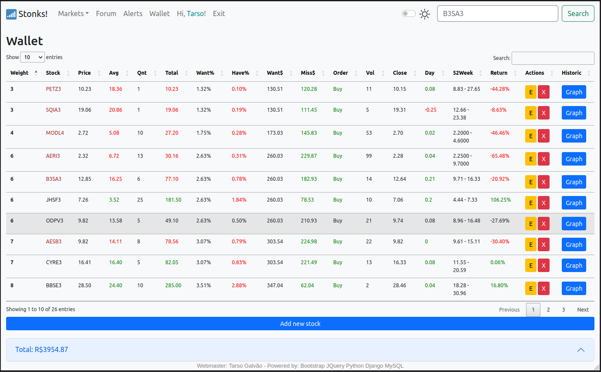

# Index of `stocks`

- [Stock Picker](#stock-picker-page-documentation)
- [Stock Tracker](#stock-tracker-page-documentation)
- [Stock Graphs](#stock-graph-page-documentation)
- [Portfolio Management](#wallet-page-documentation)
- [New Asset Creation](#new-asset-creation-page-documentation)

# Introduction

In this documentation, you will find detailed information about the various components of the application, including their functionality, purpose, and usage. Each section will cover a specific aspect of the application, guiding you through the features and how to interact with them effectively.
These pages collectively form the core functionality of the application, helping users make informed investment decisions, track their portfolio's performance, analyze historical data, and manage their assets effectively.

Feel free to navigate to the relevant sections using the links provided above to learn more about each page's purpose, content, and usage.

# Stock Picker Page Documentation
<p></p>

The [stockpicker.html](stockpicker.html) page provides users with the ability to select and track stocks within a chosen market. This page allows users to choose specific stocks from a dropdown menu, enabling them to monitor the stock prices and relevant information.

## Contents

1. [Extending Base Template](#extending-base-template)
2. [Page Title](#page-title-picker)
3. [Stock Picker Form](#stock-picker-form)
4. [Stock Selection](#stock-selection)
5. [Search Button](#search-button)

## Extending Base Template

```html

```

The `stockpicker.html` page extends the base template `'mainapp/basic.html'`, ensuring consistent styling and layout throughout the application.

## Page Title `picker`

```html

Stonks! - Picker

```

The title of the `stockpicker.html` page is set to "Stonks! - Picker", which is displayed in the browser tab.

## Stock Picker Form

```html
<form class="form-control bg-light" action="/stocktracker">
```

The stock picker form initiates a request to the "/stocktracker" URL, where users can view the selected stocks' details and information.

## Stock Selection

```html
<select class="form-select form-select-lg mb-3" size="15" multiple aria-label="multiple select example" name="stockpicker">
    
    <option value="{{i}}">{{i}}</option>
    
</select><br>
```

The dropdown menu allows users to select multiple stocks from the list of available tickers. The options are generated dynamically based on the stockpicker data. Users can choose which stocks they wish to track by selecting the respective options.

## Search Button

```html
<div class="d-grid gap-2">
    <input class="btn btn-primary" type="submit" value="Pesquisar">
</div>
```

The "Pesquisar" (Search) button enables users to submit their selected stock choices for tracking. When clicked, the button triggers the form submission, redirecting users to the "/stocktracker" page to view the selected stock information.

## Conclusion

The `stockpicker.html` page offers users a convenient way to select and track stocks within a chosen market. By extending the base template, it ensures consistent styling and layout. This documentation provides insights into how users can effectively use this page to select specific stocks for monitoring, enhancing their engagement and decision-making in stock tracking.

[Back to top](#index-of-stocks)

# Stock Tracker Page Documentation
<p></p>

The [stocktracker.html](stocktracker.html) page displays selected stocks along with their real-time market data, such as prices, changes, market cap, and more. This page offers users an organized and informative view of their chosen stocks for monitoring.

## Contents

1. [Extending Base Template and Loading Static Files](#extending-base-template-and-loading-static-files)
2. [Page Title](#page-title-tracker)
3. [Table Head](#table-head)
4. [Table Body](#table-body)
5. [Change Calculation and Styling](#change-calculation-and-styling)
6. [Historical Graph Button](#historical-graph-button)
7. [Create Alert Button](#create-alert-button)
8. [Websocket for Real-time Updates](#websocket-for-real-time-updates)
9. [jQuery and Datatables](#jquery-and-datatables)

## Extending Base Template and Loading Static Files

```html


```

The `stocktracker.html` page extends the base template `'mainapp/basic.html'` and loads necessary static files for styling and scripting.

## Page Title `Tracker`

```html


Stonks! - Tracker

```

The page title is set to "Stonks! - Tracker", which appears in the browser tab.

## Table Head

```html
<thead class="table-light">
  <tr>
    <!-- Column headings -->
  </tr>
</thead>
```

The table head contains column headings for the data that will be displayed in the table.

## Table Body

```html
<tbody>
  
  <tr>
    <!-- Data cells -->
  </tr>
  
</tbody>
```

The table body contains rows of data, each corresponding to a selected stock. The stock data is retrieved from the `data` dictionary.

## Change Calculation and Styling

```html
<td id="{{key}}_change">
  <!-- Change calculation and styling script -->
</td>
```

The change in stock price is calculated using JavaScript and styled based on whether the change is positive or negative.

## Historical Graph Button

```html
<td>
  <form action='graph'>
    <button class="btn btn-primary btn-sm" name='ticker' value={{key}} type="submit">Gráfico</button>
  </form>
</td>
```

A button allows users to view a historical graph of the selected stock's performance over time.

## Create Alert Button

```html
<a class="btn btn-primary btn-sm d-grid gap-2" href="">Criar Alerta</a>
```

Users can create alerts for specific stocks using this button.

## Websocket for Real-time Updates

```html
{{ room_name|json_script:"room-name" }}
<script type="text/javascript" src=""></script>
```

A websocket script (`live-stocks.js`) provides real-time updates for stock data using Celery.

## jQuery and Datatables

```html
<script type="text/javascript" src=""></script>
<script type="text/javascript" charset="utf8" src=""></script>
<script type="text/javascript" src=""></script>
```

jQuery and Datatables scripts enhance the functionality of the stock table, including sorting and filtering options.

## Conclusion

The `stocktracker.html` page offers users a comprehensive view of their selected stocks' real-time market data. With organized tables, dynamic change calculations, historical graph options, and real-time updates, users can effectively monitor and analyze their chosen stocks' performance, supporting informed investment decisions.


[Back to top](#index-of-stocks)

# Stock Graph Page Documentation

The [graph.html](graph.html) page is where users can view historical price data for a specific stock in the form of a candlestick chart. This page provides an interactive visualization of the stock's price movement over time.

## Contents

1. [Extending Base Template and Loading Static Files](#extending-base-template-and-loading-static-files)
2. [Page Title](#page-title-graph)
3. [Graph Display](#graph-display)
4. [Error Handling](#error-handling)

## Extending Base Template and Loading Static Files

```html


```

The `graph.html` page extends the base template `'mainapp/basic.html'` and loads necessary static files for styling and scripting.

## Page Title `Graph`

```html

Stonks! - Graph

```

The page title is set to "Stonks! - Graph", which appears in the browser tab.

## Graph Display

```html
<div class="container graph-container">
    <center><h2>{{ ticker }}</h2><center>
        
    
        <div class="thegraph">
        {{ graph|safe }}
        </div>
    

        <br><br>
        <p>An error has occurred.</p>

    

</div>
```

The graph container displays the title of the stock (`ticker`) and renders the candlestick chart using the `graph` variable. The graph is safely rendered using the `safe` filter to prevent any unintended HTML escaping.

## Error Handling

If there is an issue with rendering the graph data, an error message is displayed to the user.

## Conclusion

The `graph.html` page provides users with an interactive candlestick chart to visualize the historical price movement of a selected stock. Users can gain insights into price trends and patterns, helping them make more informed investment decisions based on the stock's historical performance.

[Back to top](#index-of-stocks)

# Wallet Page Documentation
<p></p>

The [carteira.html](carteira.html) page is where users can manage their portfolio of stocks and track their performance over time. Users can add stocks to their portfolio, assign weights or notes to each stock, and view various metrics that help them balance their portfolio effectively.

## Contents

1. [Extending Base Template and Loading Static Files](#extending-base-template-and-loading-static-files)
2. [Page Title](#page-title-wallet)
3. [Table Layout](#table-layout)
4. [Data Filling and Balance Calculation](#data-filling-and-balance-calculation)
5. [Total Portfolio Value](#total-portfolio-value)
6. [Graphs and Analytics](#graphs-and-analytics)
7. [Conclusion](#conclusion)

## Extending Base Template and Loading Static Files

```html


```

The `carteira.html` page extends the base template `'mainapp/basic.html'` and loads necessary static files for styling and scripting.

## Page Title `Wallet`

```html

Stonks! - Wallet

```

The page title is set to "Stonks! - Wallet", which appears in the browser tab.

## Table Layout

The page features a table that displays various metrics related to the user's stock portfolio. The table includes columns for attributes such as weight, stock ticker, price, average price, quantity, total value, desired percentage, actual percentage, desired value, missing value, order suggestion, volume for buying/selling, price change, 52-week range, return, actions, and historical data.

## Data Filling and Balance Calculation

The table is populated with data from the user's portfolio (`data`). Expressions within the table calculate and display various metrics, including:

- Weight (nota/peso)
- Total value (quantity * market price)
- Desired percentage (nota/sum(notas)%)
- Actual percentage (total/totais%)
- Desired value (patrimonio * quero%)
- Missing value (quero_din - total)
- Order suggestion (buy or wait based on quero and tenho percentages)
- Volume for buying/selling (falta / price)
- Price change during the day
- 52-week price range
- Return (percentage change based on average price)
- Action buttons for editing and deleting stocks
- Graph button for viewing historical data

## Total Portfolio Value

A collapsible accordion element displays the total value of the user's portfolio. This value is used to calculate various expressions related to portfolio balance.

## Graphs and Analytics

The page includes a section where graphs and analytics can be displayed, helping users visualize the performance of their portfolio over time.

## Conclusion

The `carteira.html` page offers users a comprehensive view of their stock portfolio, allowing them to analyze and manage their investments effectively. By providing various metrics, order suggestions, and historical data, this page assists users in making informed decisions about their investment strategies and maintaining a balanced portfolio.

[Back to top](#index-of-stocks)

# New Asset Creation Page Documentation

The [carteira_form.html](carteira_form.html) page is where users can create and add new assets to their portfolio on the "Wallet" page. This page allows users to enter details about the new asset, such as its ticker symbol, quantity, and average price. The entered data will be used to track and analyze the performance of the new asset within their portfolio.

## Contents

1. [Extending Base Template](#extending-base-template)
2. [Page Title](#page-title)
3. [Form for New Asset Creation](#form-for-new-asset-creation)
4. [Submission](#submission)
5. [Conclusion](#conclusion)

## Extending Base Template

```html

```

The `carteira_form.html` page extends the base template `'mainapp/basic.html'`.

## Page Title

```html

Stonks! - Wallet

```

The page title is set to "Stonks! - Wallet", which appears in the browser tab.

## Form for New Asset Creation

The page includes a form (`carteira_form`) for users to enter information about the new asset they want to add to their portfolio. The form includes fields such as:

- Ticker symbol: The unique identifier for the asset.
- Quantity: The number of units of the asset owned by the user.
- Average price: The average price at which the user acquired the asset.

Users are required to fill out these fields with accurate information.

## Submission

Upon completing the form, users can click the "Update" button to submit the form and create the new asset within their portfolio. The entered data will be processed and added to the user's portfolio, allowing them to track the performance of the new asset on the "Wallet" page.

## Conclusion

The `carteira_form.html` page provides users with a convenient way to add new assets to their portfolio. By entering accurate information about the asset's details, users can maintain an accurate representation of their investment portfolio and effectively track their investments' performance over time on the "Wallet" page.

[Back to top](#index-of-stocks)
